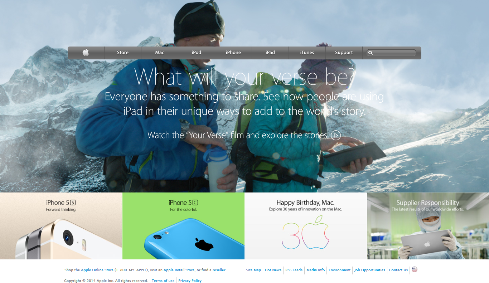

# MC-project4-Apple

## Microverse HTML/CSS project 4 - Individual
Individual Project to create an Apple clone page, using basic HTML and CSS.

#### I. The main focus of the project was the creation of a standard main page by using background images and gradients.

#### II. The project was not prepared for mobile use and no mobile queries were used.

#### III. The main areas of the project can be divided as follows:

  ###### &nbsp; The background section
  It was created by using a background picture, and has links to some promo articles.

  ###### &nbsp; The navbar section
  It comprises the links to the main sections of the site. When passing the mouse over they have the effect of highlighting with a different background.

  ###### &nbsp; The promo section
  It contains links to the site promo sections. When passing the mouse over they have the effect of highlighting with a different background.

  ###### &nbsp; The footer section
  It has the relevant contact links and the copyright notice.  

## Built With

- HTML, CSS
- Code Editors- Atom
## Live Demo

- [Live Demo Link](https://rawcdn.githack.com/Jhdezj/MC-project4-Apple/11c4d5c74c3f280dfed416204340dc56ce51bfe6/index.html)

## Author

👤 **Jorge Hernandez**

- Github: [@Jhdezj](https://github.com/Jhdezj)
